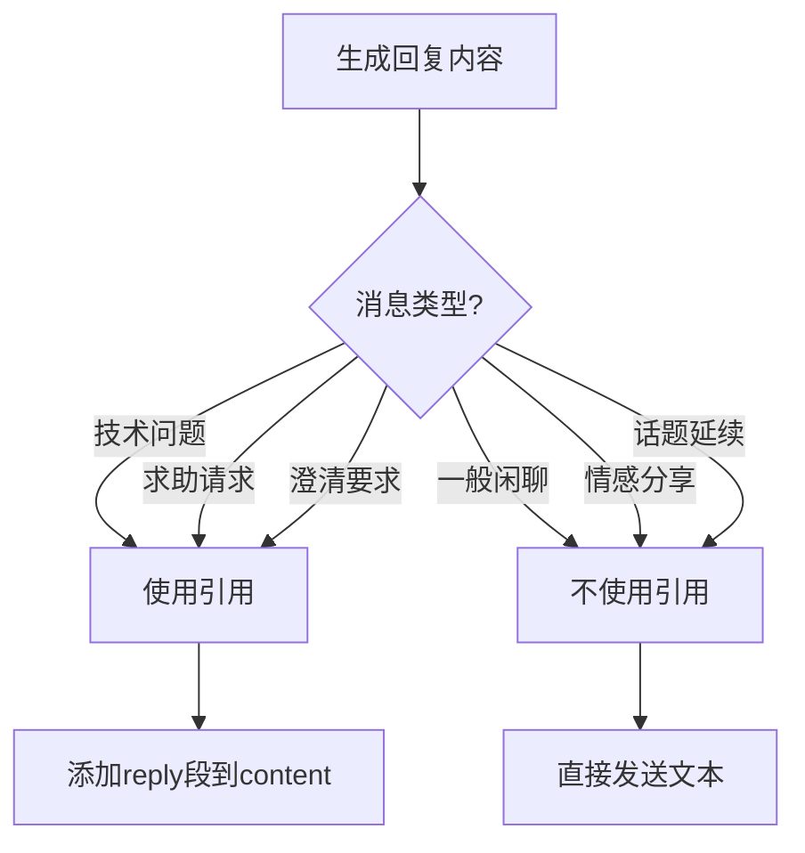

# 智能回复策略设计知识文档

## 核心设计理念

### 自然交互原则

智能回复功能的设计遵循"自然交互"原则，即机器人的回复行为应该尽可能模拟真人在群聊中的自然表现：

1. **场景感知**：区分闲聊和问答场景
2. **对象识别**：准确判断对话的目标对象
3. **引用智能**：只在必要时使用回复引用
4. **思考透明**：通过思考链展示决策过程

## 设计模式应用

### 责任链模式 (Chain of Responsibility)

LLM的思考过程实际上是一个责任链：

```typescript
interface ThoughtChain {
    process(context: ConversationContext): ThoughtResult;
}

// 具体思考链节点
class ObjectIdentificationThought implements ThoughtChain {
    process(context: ConversationContext): ThoughtResult {
        // 识别对话对象
        return {
            thought: "分析消息目标对象...",
            shouldContinue: true
        };
    }
}

class ReplyDecisionThought implements ThoughtChain {
    process(context: ConversationContext): ThoughtResult {
        // 决定是否回复
        return {
            thought: "基于对象识别结果决定回复策略...",
            shouldReply: boolean
        };
    }
}
```

### 策略模式在回复类型中的应用

```typescript
interface ReplyStrategy {
    shouldUseReplyReference(context: MessageContext): boolean;
    generateReplyContent(context: MessageContext): SendMessageSegment[];
}

class NaturalConversationStrategy implements ReplyStrategy {
    shouldUseReplyReference(): boolean {
        return false; // 自然对话不使用引用
    }
    
    generateReplyContent(context: MessageContext): SendMessageSegment[] {
        // 生成自然的回复内容
    }
}

class QuestionAnswerStrategy implements ReplyStrategy {
    shouldUseReplyReference(): boolean {
        return true; // 问答场景使用引用
    }
    
    generateReplyContent(context: MessageContext): SendMessageSegment[] {
        // 生成带引用的回答内容
    }
}
```

## Few-Shot Learning 设计

### 示例驱动的行为学习

通过精心设计的示例，教会LLM特定的行为模式：

#### 示例分类
1. **对象识别示例**：A问B vs A问群里所有人
2. **回复策略示例**：何时使用引用 vs 自然回复
3. **思考过程示例**：展示完整的推理链

#### 示例构建原则
- **覆盖性**：涵盖主要使用场景
- **对比性**：正面和负面示例对比
- **渐进性**：从简单到复杂的示例顺序
- **真实性**：基于实际群聊场景构建

### Prompt Engineering 最佳实践

#### 结构化提示设计
```
<role_definition>
你是一个友好的QQ群聊参与者，名字是小镜
</role_definition>

<context_injection>
你的QQ号是: {bot_qq}
</context_injection>

<behavior_rules>
重要的行为规则和判断标准
</behavior_rules>

<examples>
具体的行为示例
</examples>

<output_format>
严格的输出格式要求
</output_format>
```

#### 上下文窗口优化
- **动态内容注入**：机器人QQ号等关键信息
- **历史压缩**：保留关键信息，压缩冗余内容
- **角色一致性**：确保system/user/assistant角色正确

## 状态机设计

### 对话状态管理

```typescript
enum ConversationState {
    IDLE,           // 空闲状态
    ANALYZING,      // 分析消息中
    THINKING,       // LLM思考中
    REPLYING,       // 生成回复中
    WAITING         // 等待下条消息
}

class ConversationStateMachine {
    private state: ConversationState = ConversationState.IDLE;
    
    transition(event: ConversationEvent): void {
        switch (this.state) {
            case ConversationState.IDLE:
                if (event.type === 'MESSAGE_RECEIVED') {
                    this.state = ConversationState.ANALYZING;
                }
                break;
            // ... 其他状态转换
        }
    }
}
```

## 元数据设计模式

### 关注点分离

Message接口的metadata设计体现了关注点分离原则：

- **核心数据**：id, content, userId等业务核心字段
- **处理数据**：thoughts, hasReply等处理过程信息
- **关系数据**：replyToMessageId等关联关系

### 扩展性设计

```typescript
interface MessageMetadata {
    // 已实现功能
    thoughts?: string[];
    hasReply?: boolean;
    replyToMessageId?: string;
    
    // 预留扩展字段
    sentiment?: 'positive' | 'negative' | 'neutral';
    priority?: number;
    tags?: string[];
    processingFlags?: ProcessingFlag[];
}
```

## 决策树设计

### 回复决策流程

```mermaid
graph TD
    A[接收消息] --> B{是否@我?}
    B -->|是| C[必须回复]
    B -->|否| D{是否询问所有人?}
    D -->|是| E{是否适合参与?}
    D -->|否| F{用户A问用户B?}
    F -->|是| G[保持沉默]
    F -->|否| E
    E -->|是| H[考虑回复]
    E -->|否| G
    H --> I{回复类型?}
    I -->|问答| J[使用回复引用]
    I -->|闲聊| K[自然回复]
    C --> I
```

### 引用使用决策树



## 性能优化设计

### 懒加载策略

```typescript
class MessageProcessor {
    private botContext: string | null = null;
    
    private getBotContext(): string {
        if (this.botContext === null) {
            this.botContext = this.buildBotContextString();
        }
        return this.botContext;
    }
}
```

### 缓存策略

```typescript
class PromptCache {
    private static systemPromptCache = new Map<string, string>();
    
    static getSystemPrompt(botQQ: number, basePrompt: string): string {
        const key = `${botQQ}:${hashString(basePrompt)}`;
        if (!this.systemPromptCache.has(key)) {
            this.systemPromptCache.set(key, this.buildSystemPrompt(botQQ, basePrompt));
        }
        return this.systemPromptCache.get(key)!;
    }
}
```

## 监控和可观测性

### 决策过程追踪

```typescript
interface DecisionTrace {
    messageId: string;
    timestamp: Date;
    botQQ: number;
    targetAnalysis: {
        isDirectMention: boolean;
        targetUserId?: number;
        confidence: number;
    };
    replyDecision: {
        shouldReply: boolean;
        useReference: boolean;
        reasoning: string[];
    };
    performance: {
        thinkingTimeMs: number;
        generationTimeMs: number;
    };
}
```

### 质量指标

- **回复准确性**：回复是否符合预期场景
- **引用合理性**：回复引用使用是否恰当
- **响应速度**：从接收到发送的时间
- **思考质量**：思考过程的逻辑性和完整性

## 错误处理和降级

### 优雅降级策略

```typescript
class ReplyGenerator {
    async generateReply(message: Message): Promise<ReplyResult> {
        try {
            return await this.generateAdvancedReply(message);
        } catch (error) {
            console.warn('高级回复生成失败，降级到简单模式', error);
            return await this.generateSimpleReply(message);
        }
    }
    
    private async generateSimpleReply(message: Message): Promise<ReplyResult> {
        // 简化版回复逻辑，不使用复杂的对象识别
        return {
            thoughts: ['使用简化回复模式'],
            reply: this.generateBasicResponse(message)
        };
    }
}
```

### 错误恢复机制

1. **思考链错误**：降级到简单回复模式
2. **对象识别错误**：默认为询问机器人
3. **引用解析错误**：不使用引用功能
4. **LLM服务错误**：使用预设回复模板

## 测试策略

### 行为驱动测试

```typescript
describe('智能回复策略', () => {
    it('应该在A问B时保持沉默', async () => {
        const message = createMentionMessage(userA.id, userB.id, '你在做什么？');
        const result = await handler.processMessage(message);
        expect(result.shouldReply).toBe(false);
        expect(result.thoughts).toContain('这是两个用户之间的对话');
    });
    
    it('应该在技术问答时使用引用', async () => {
        const message = createQuestionMessage('Python怎么读文件？');
        const result = await handler.processMessage(message);
        expect(result.shouldReply).toBe(true);
        expect(result.reply).toContainReplySegment();
    });
});
```

### 端到端测试

```typescript
class ConversationSimulator {
    simulate(scenario: ConversationScenario): TestResult {
        // 模拟完整的对话场景
        // 验证机器人行为的一致性和合理性
    }
}
```

## 未来扩展方向

### 1. 学习型回复策略
- 基于用户反馈调整回复策略
- A/B测试不同的回复风格
- 个性化回复偏好学习

### 2. 多模态回复支持
- 表情包回复策略
- 图片内容理解和回复
- 语音消息处理

### 3. 上下文记忆增强
- 长期对话记忆
- 跨会话的用户偏好记忆
- 群组特征学习

### 4. 实时优化
- 在线学习算法
- 实时策略调整
- 动态prompt优化